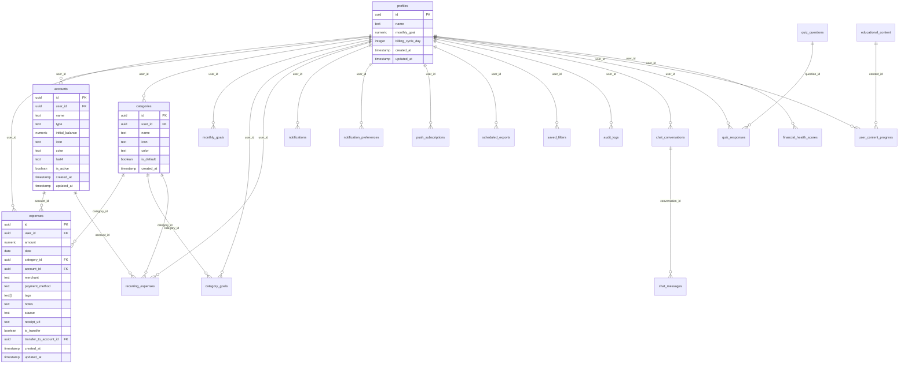

# 🗄️ Modelo de Dados

Documentação completa das 21 tabelas do banco de dados PostgreSQL.

---

## 📊 Diagrama ER

---

## 📋 Tabelas

### 1. profiles
Dados do perfil do usuário (extensão do auth.users).

| Coluna | Tipo | Nullable | Default | Descrição |
|--------|------|----------|---------|-----------|
| `id` | uuid | ❌ | - | PK, referência auth.users |
| `name` | text | ❌ | - | Nome do usuário |
| `monthly_goal` | numeric | ✅ | 0 | Meta mensal padrão |
| `billing_cycle_day` | integer | ✅ | 1 | Dia do ciclo (1-28) |
| `created_at` | timestamptz | ✅ | now() | - |
| `updated_at` | timestamptz | ✅ | now() | - |

**Trigger:** Criado automaticamente via `handle_new_user()` no signup.

---

### 2. expenses
Registro de todas as despesas.

| Coluna | Tipo | Nullable | Default | Descrição |
|--------|------|----------|---------|-----------|
| `id` | uuid | ❌ | gen_random_uuid() | PK |
| `user_id` | uuid | ❌ | - | FK profiles |
| `amount` | numeric | ❌ | - | Valor da despesa |
| `date` | date | ❌ | CURRENT_DATE | Data |
| `category_id` | uuid | ✅ | - | FK categories |
| `account_id` | uuid | ✅ | - | FK accounts |
| `merchant` | text | ✅ | - | Comerciante |
| `payment_method` | text | ✅ | - | Método pagamento |
| `tags` | text[] | ✅ | - | Tags array |
| `notes` | text | ✅ | - | Observações |
| `source` | text | ❌ | 'manual' | Origem (manual/ocr/recurring) |
| `receipt_url` | text | ✅ | - | URL do recibo |
| `is_transfer` | boolean | ✅ | false | É transferência? |
| `transfer_to_account_id` | uuid | ✅ | - | Conta destino |
| `created_at` | timestamptz | ✅ | now() | - |
| `updated_at` | timestamptz | ✅ | now() | - |

**Índices:** `user_id`, `date`, `category_id`

---

### 3. categories
Categorias de despesas (padrão + customizadas).

| Coluna | Tipo | Nullable | Default | Descrição |
|--------|------|----------|---------|-----------|
| `id` | uuid | ❌ | gen_random_uuid() | PK |
| `user_id` | uuid | ✅ | - | FK (null = padrão) |
| `name` | text | ❌ | - | Nome |
| `icon` | text | ❌ | '💰' | Emoji |
| `color` | text | ❌ | '#10b981' | Cor hex |
| `is_default` | boolean | ✅ | false | Categoria padrão? |
| `created_at` | timestamptz | ✅ | now() | - |

**Categorias Padrão:** Alimentação, Transporte, Moradia, Saúde, Lazer, Educação, Compras, Outros.

---

### 4. accounts
Contas financeiras do usuário.

| Coluna | Tipo | Nullable | Default | Descrição |
|--------|------|----------|---------|-----------|
| `id` | uuid | ❌ | gen_random_uuid() | PK |
| `user_id` | uuid | ❌ | - | FK profiles |
| `name` | text | ❌ | - | Nome da conta |
| `type` | text | ❌ | - | Tipo (wallet/checking/savings/credit/investment) |
| `initial_balance` | numeric | ✅ | 0 | Saldo inicial |
| `icon` | text | ✅ | '💳' | Emoji |
| `color` | text | ✅ | '#3B82F6' | Cor hex |
| `last4` | text | ✅ | - | Últimos 4 dígitos |
| `is_active` | boolean | ✅ | true | Ativa? |
| `created_at` | timestamptz | ✅ | now() | - |
| `updated_at` | timestamptz | ✅ | now() | - |

**Trigger:** Contas padrão criadas via `create_default_accounts()`.

---

### 5. monthly_goals
Metas mensais globais.

| Coluna | Tipo | Nullable | Default | Descrição |
|--------|------|----------|---------|-----------|
| `id` | uuid | ❌ | gen_random_uuid() | PK |
| `user_id` | uuid | ❌ | - | FK profiles |
| `month` | text | ❌ | - | Formato 'YYYY-MM' |
| `total_limit` | numeric | ❌ | - | Limite total |
| `created_at` | timestamptz | ✅ | now() | - |

**Constraint:** UNIQUE(user_id, month)

---

### 6. category_goals
Metas por categoria.

| Coluna | Tipo | Nullable | Default | Descrição |
|--------|------|----------|---------|-----------|
| `id` | uuid | ❌ | gen_random_uuid() | PK |
| `user_id` | uuid | ❌ | - | FK profiles |
| `category_id` | uuid | ❌ | - | FK categories |
| `month` | text | ❌ | - | Formato 'YYYY-MM' |
| `limit_amount` | numeric | ❌ | - | Limite |
| `created_at` | timestamptz | ✅ | now() | - |
| `updated_at` | timestamptz | ✅ | now() | - |

---

### 7. recurring_expenses
Despesas recorrentes configuradas.

| Coluna | Tipo | Nullable | Default | Descrição |
|--------|------|----------|---------|-----------|
| `id` | uuid | ❌ | gen_random_uuid() | PK |
| `user_id` | uuid | ❌ | - | FK profiles |
| `merchant` | text | ❌ | - | Nome/descrição |
| `amount` | numeric | ❌ | - | Valor |
| `frequency` | text | ❌ | - | daily/weekly/monthly/yearly |
| `category_id` | uuid | ✅ | - | FK categories |
| `account_id` | uuid | ✅ | - | FK accounts |
| `payment_method` | text | ✅ | - | Método pagamento |
| `notes` | text | ✅ | - | Observações |
| `start_date` | date | ❌ | - | Data início |
| `end_date` | date | ✅ | - | Data fim (opcional) |
| `next_occurrence` | date | ❌ | - | Próxima execução |
| `is_active` | boolean | ✅ | true | Ativa? |
| `created_at` | timestamptz | ✅ | now() | - |
| `updated_at` | timestamptz | ✅ | now() | - |

---

### 8. notifications
Notificações do sistema.

| Coluna | Tipo | Nullable | Default | Descrição |
|--------|------|----------|---------|-----------|
| `id` | uuid | ❌ | gen_random_uuid() | PK |
| `user_id` | uuid | ❌ | - | FK profiles |
| `type` | text | ❌ | - | Tipo da notificação |
| `payload` | jsonb | ❌ | '{}' | Dados extras |
| `read` | boolean | ❌ | false | Lida? |
| `ref_month` | text | ✅ | - | Mês referência |
| `created_at` | timestamptz | ❌ | now() | - |

**Tipos:** GOAL_80, GOAL_100, GOAL_ECONOMY, category_variation, recurring_expense, scheduled_export

---

### 9. notification_preferences
Preferências de notificação do usuário.

| Coluna | Tipo | Nullable | Default | Descrição |
|--------|------|----------|---------|-----------|
| `id` | uuid | ❌ | gen_random_uuid() | PK |
| `user_id` | uuid | ❌ | - | FK profiles |
| `budget_alert_threshold` | integer | ✅ | 80 | % para alerta |
| `spending_pattern_alert` | boolean | ✅ | true | Alertas variação |
| `expense_reminder_days` | integer | ✅ | 3 | Dias sem registrar |
| `monthly_review_enabled` | boolean | ✅ | true | Resumo mensal |
| `proactive_insights_enabled` | boolean | ✅ | true | Insights IA |
| `created_at` | timestamptz | ✅ | now() | - |
| `updated_at` | timestamptz | ✅ | now() | - |

---

### 10. push_subscriptions
Subscriptions para Web Push.

| Coluna | Tipo | Nullable | Default | Descrição |
|--------|------|----------|---------|-----------|
| `id` | uuid | ❌ | gen_random_uuid() | PK |
| `user_id` | uuid | ❌ | - | FK profiles |
| `endpoint` | text | ❌ | - | Push endpoint URL |
| `p256dh` | text | ❌ | - | Chave pública |
| `auth` | text | ❌ | - | Auth secret |
| `created_at` | timestamptz | ✅ | now() | - |
| `updated_at` | timestamptz | ✅ | now() | - |

---

### 11. vapid_keys
Chaves VAPID para Push Notifications (sistema).

| Coluna | Tipo | Nullable | Default | Descrição |
|--------|------|----------|---------|-----------|
| `id` | uuid | ❌ | gen_random_uuid() | PK |
| `public_key` | text | ❌ | - | Chave pública |
| `private_key` | text | ❌ | - | Chave privada |
| `created_at` | timestamptz | ❌ | now() | - |

**RLS:** Bloqueado para todos (apenas service role).

---

### 12. scheduled_exports
Exportações agendadas.

| Coluna | Tipo | Nullable | Default | Descrição |
|--------|------|----------|---------|-----------|
| `id` | uuid | ❌ | gen_random_uuid() | PK |
| `user_id` | uuid | ❌ | - | FK profiles |
| `name` | text | ❌ | - | Nome do agendamento |
| `format` | text | ❌ | - | csv/json/pdf |
| `frequency` | text | ❌ | - | daily/weekly/monthly |
| `filters` | jsonb | ✅ | '{}' | Filtros aplicados |
| `next_run_at` | timestamptz | ❌ | - | Próxima execução |
| `last_run_at` | timestamptz | ✅ | - | Última execução |
| `is_active` | boolean | ✅ | true | Ativo? |
| `created_at` | timestamptz | ✅ | now() | - |
| `updated_at` | timestamptz | ✅ | now() | - |

---

### 13. saved_filters
Filtros salvos pelo usuário.

| Coluna | Tipo | Nullable | Default | Descrição |
|--------|------|----------|---------|-----------|
| `id` | uuid | ❌ | gen_random_uuid() | PK |
| `user_id` | uuid | ❌ | - | FK profiles |
| `name` | text | ❌ | - | Nome do filtro |
| `filters` | jsonb | ❌ | - | Configuração |
| `is_favorite` | boolean | ✅ | false | Favorito? |
| `created_at` | timestamptz | ✅ | now() | - |
| `updated_at` | timestamptz | ✅ | now() | - |

---

### 14. audit_logs
Logs de auditoria de ações.

| Coluna | Tipo | Nullable | Default | Descrição |
|--------|------|----------|---------|-----------|
| `id` | uuid | ❌ | gen_random_uuid() | PK |
| `user_id` | uuid | ❌ | - | FK profiles |
| `action` | text | ❌ | - | CREATE/UPDATE/DELETE |
| `entity` | text | ❌ | - | Tipo entidade |
| `entity_id` | uuid | ❌ | - | ID da entidade |
| `before_data` | jsonb | ✅ | - | Dados antes |
| `after_data` | jsonb | ✅ | - | Dados depois |
| `ip_address` | text | ✅ | - | IP (opcional) |
| `user_agent` | text | ✅ | - | Browser (opcional) |
| `created_at` | timestamptz | ✅ | now() | - |

**RLS:** Usuário só pode visualizar, sistema insere via SECURITY DEFINER.

---

### 15. chat_conversations
Conversas do chat assistant.

| Coluna | Tipo | Nullable | Default | Descrição |
|--------|------|----------|---------|-----------|
| `id` | uuid | ❌ | gen_random_uuid() | PK |
| `user_id` | uuid | ❌ | - | FK profiles |
| `title` | text | ✅ | - | Título da conversa |
| `created_at` | timestamptz | ❌ | now() | - |
| `updated_at` | timestamptz | ❌ | now() | - |

---

### 16. chat_messages
Mensagens individuais do chat.

| Coluna | Tipo | Nullable | Default | Descrição |
|--------|------|----------|---------|-----------|
| `id` | uuid | ❌ | gen_random_uuid() | PK |
| `conversation_id` | uuid | ❌ | - | FK chat_conversations |
| `user_id` | uuid | ❌ | - | FK profiles |
| `role` | text | ❌ | - | user/assistant |
| `content` | text | ❌ | - | Conteúdo |
| `created_at` | timestamptz | ❌ | now() | - |

---

### 17. educational_content
Conteúdo educativo (gerenciado pelo sistema).

| Coluna | Tipo | Nullable | Default | Descrição |
|--------|------|----------|---------|-----------|
| `id` | uuid | ❌ | gen_random_uuid() | PK |
| `title` | text | ❌ | - | Título |
| `description` | text | ❌ | - | Descrição curta |
| `content` | text | ❌ | - | Conteúdo completo |
| `category` | text | ❌ | - | Categoria |
| `level` | text | ❌ | - | Nível dificuldade |
| `type` | text | ❌ | - | article/video/tip/guide |
| `reading_time` | integer | ✅ | - | Tempo leitura (min) |
| `video_url` | text | ✅ | - | URL do vídeo |
| `created_at` | timestamptz | ❌ | now() | - |
| `updated_at` | timestamptz | ❌ | now() | - |

**RLS:** Público para leitura, sem escrita para usuários.

---

### 18. user_content_progress
Progresso do usuário em conteúdo educativo.

| Coluna | Tipo | Nullable | Default | Descrição |
|--------|------|----------|---------|-----------|
| `id` | uuid | ❌ | gen_random_uuid() | PK |
| `user_id` | uuid | ❌ | - | FK profiles |
| `content_id` | uuid | ❌ | - | FK educational_content |
| `completed` | boolean | ❌ | false | Completado? |
| `completed_at` | timestamptz | ✅ | - | Data conclusão |
| `created_at` | timestamptz | ❌ | now() | - |

---

### 19. quiz_questions
Perguntas do quiz (gerenciado pelo sistema).

| Coluna | Tipo | Nullable | Default | Descrição |
|--------|------|----------|---------|-----------|
| `id` | uuid | ❌ | gen_random_uuid() | PK |
| `question` | text | ❌ | - | Texto da pergunta |
| `options` | jsonb | ❌ | - | Array de opções |
| `correct_answer` | text | ❌ | - | Resposta correta |
| `explanation` | text | ❌ | - | Explicação |
| `category` | text | ❌ | - | Categoria |
| `difficulty` | text | ❌ | - | easy/medium/hard |
| `points` | integer | ❌ | 10 | Pontos |
| `created_at` | timestamptz | ❌ | now() | - |

**RLS:** Público para leitura, sem escrita para usuários.

---

### 20. quiz_responses
Respostas do usuário ao quiz.

| Coluna | Tipo | Nullable | Default | Descrição |
|--------|------|----------|---------|-----------|
| `id` | uuid | ❌ | gen_random_uuid() | PK |
| `user_id` | uuid | ❌ | - | FK profiles |
| `question_id` | uuid | ❌ | - | FK quiz_questions |
| `user_answer` | text | ❌ | - | Resposta dada |
| `is_correct` | boolean | ❌ | - | Acertou? |
| `points_earned` | integer | ❌ | 0 | Pontos ganhos |
| `completed_at` | timestamptz | ❌ | now() | - |

---

### 21. financial_health_scores
Scores de saúde financeira históricos.

| Coluna | Tipo | Nullable | Default | Descrição |
|--------|------|----------|---------|-----------|
| `id` | uuid | ❌ | gen_random_uuid() | PK |
| `user_id` | uuid | ❌ | - | FK profiles |
| `month` | text | ❌ | - | Formato 'YYYY-MM' |
| `score` | integer | ❌ | - | Score total (0-100) |
| `budget_adherence_score` | integer | ❌ | 0 | Componente orçamento |
| `quiz_performance_score` | integer | ❌ | 0 | Componente quiz |
| `consistency_score` | integer | ❌ | 0 | Componente consistência |
| `savings_score` | integer | ❌ | 0 | Componente economia |
| `created_at` | timestamptz | ❌ | now() | - |

---

## 🔧 Funções de Banco

### Funções RPC

| Função | Parâmetros | Retorno | Descrição |
|--------|------------|---------|-----------|
| `calculate_financial_health_score` | user_id, month | scores | Calcula score |
| `get_billing_period` | user_id, reference_date | start/end dates | Período do ciclo |
| `sum_expenses_in_month` | user_id, month | numeric | Soma despesas |
| `upsert_monthly_goals` | user_id, months[], limit | void | Criar/atualizar metas |
| `create_audit_log` | action, entity, entity_id, before, after | void | Inserir log |

### Triggers

| Trigger | Tabela | Evento | Função |
|---------|--------|--------|--------|
| `handle_new_user` | auth.users | INSERT | Cria profile |
| `create_default_accounts` | profiles | INSERT | Cria contas padrão |
| `audit_expenses` | expenses | ALL | Registra alterações |
| `audit_accounts` | accounts | ALL | Registra alterações |
| `audit_categories` | categories | ALL | Registra alterações |
| `audit_category_goals` | category_goals | ALL | Registra alterações |
| `update_updated_at` | várias | UPDATE | Atualiza timestamp |

---

## 🔗 Links Relacionados

- [Segurança e RLS](./SECURITY.md)
- [Edge Functions](./API.md)
- [Funcionalidades](./FEATURES.md)
