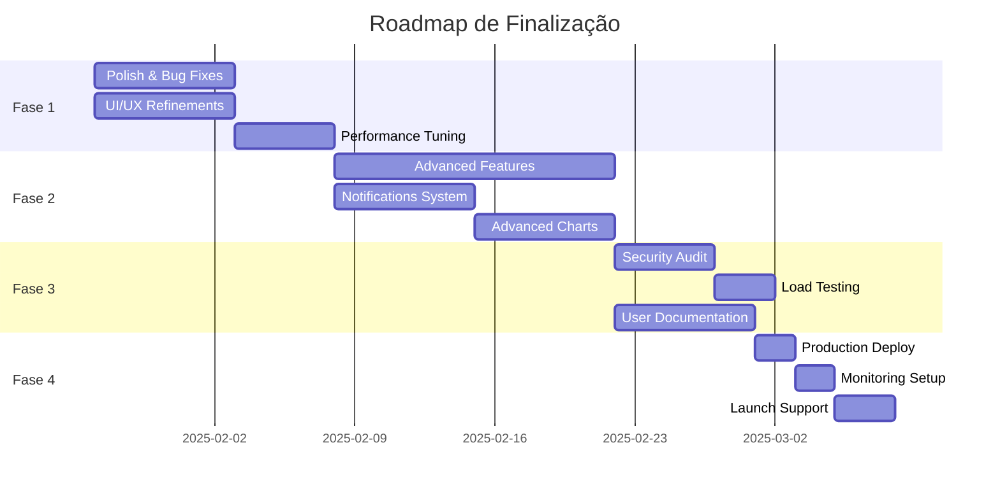

# Plano de Finalização - Expense Tracker App

## Visão Geral

Este documento detalha o plano estratégico para finalizar o **Expense Tracker App** e prepará-lo para lançamento em produção.

**Status Atual:** v6.0.0 - Sprints 1-5 Concluídos  
**Meta:** v7.0.0 - Production Ready  
**Timeline Estimado:** 4-6 semanas  
**Prioridade:** 🔴 Alta

---

## Roadmap de Finalização

---

## Fase 1: Polish & Refinement (1-2 semanas)

### Objetivo
Polir a aplicação existente, corrigir bugs menores e refinar a experiência do usuário.

### 1.1 UI/UX Refinements

#### Dashboard
- [ ] Adicionar skeleton loaders em todos os cards
- [ ] Melhorar animações de transição entre estados
- [ ] Ajustar spacing e alignment em mobile
- [ ] Adicionar empty states mais informativos
- [ ] Tooltip explicativo em todos os ícones

#### Formulários
- [ ] Melhorar feedback de validação em tempo real
- [ ] Adicionar formatação automática de valores (moeda)
- [ ] Implementar autocomplete em campos de estabelecimento
- [ ] Adicionar sugestões de categoria baseadas em histórico
- [ ] Melhorar UX do date picker (shortcuts: hoje, ontem, etc.)

#### Relatórios
- [ ] Adicionar filtros salvos (usuário pode salvar filtros favoritos)
- [ ] Implementar comparação side-by-side de períodos
- [ ] Adicionar export scheduler (agendar exports recorrentes)
- [ ] Melhorar legibilidade dos gráficos em mobile
- [ ] Adicionar tooltips interativos nos gráficos

#### Navegação
- [ ] Breadcrumbs em páginas internas
- [ ] Back button behavior mais intuitivo
- [ ] Keyboard shortcuts (?, Ctrl+K para search)
- [ ] Indicador de página ativa no menu mais claro

### 1.2 Bug Fixes

#### Prioridade Alta
- [ ] Revisar e testar todos os E2E tests em CI
- [ ] Corrigir edge cases em cálculos de ciclo (meses com 28/29/30/31 dias)
- [ ] Validar comportamento de timezone em datas
- [ ] Testar fluxo completo de exclusão de conta
- [ ] Verificar memory leaks em realtime subscriptions

#### Prioridade Média
- [ ] Melhorar error handling em edge functions
- [ ] Adicionar retry logic em API calls críticas
- [ ] Validar input sanitization em todos os formulários
- [ ] Testar comportamento offline do PWA
- [ ] Verificar acessibilidade com screen readers

#### Prioridade Baixa
- [ ] Corrigir typos em textos
- [ ] Ajustar small visual glitches
- [ ] Melhorar mensagens de erro para serem mais user-friendly

### 1.3 Performance Tuning

#### Frontend Optimizations
- [ ] Implementar virtual scrolling em listas longas (expenses, reports)
- [ ] Adicionar image optimization (WebP, lazy loading avançado)
- [ ] Otimizar bundle size (analyze bundle, tree shake unused code)
- [ ] Implementar prefetching de rotas comuns
- [ ] Adicionar service worker caching strategy mais agressiva

#### Backend Optimizations
- [ ] Adicionar índices de banco faltantes (analisar query performance)
- [ ] Otimizar edge functions (reduce cold starts)
- [ ] Implementar database connection pooling
- [ ] Adicionar caching em queries frequentes (Redis futuro)
- [ ] Otimizar RLS policies (simplificar quando possível)

#### Query Optimizations
- [ ] Revisar todas as queries Supabase (usar `.select('field1,field2')`)
- [ ] Implementar pagination em todas as listas
- [ ] Adicionar infinite scroll onde apropriado
- [ ] Usar React Query `staleTime` de forma mais granular
- [ ] Implementar query prefetching em hover (ex: hover em expense → prefetch edit data)

### 1.4 Accessibility (A11y)

- [ ] Audit completo com WAVE e axe DevTools
- [ ] Garantir todos os elementos interativos são teclado-acessíveis
- [ ] Adicionar ARIA labels onde necessário
- [ ] Melhorar contrast ratios (meta: WCAG AAA)
- [ ] Testar com screen readers (NVDA, JAWS)
- [ ] Adicionar skip links
- [ ] Garantir focus indicators visíveis

### 1.5 Internationalization (i18n) - Preparação

- [ ] Extrair todos os textos hardcoded para constants
- [ ] Preparar estrutura para i18n futuro (pt-BR, en-US, es-ES)
- [ ] Garantir formatação de moeda suporta múltiplas locales
- [ ] Preparar date formatting para internacionalização

---

## Fase 2: Advanced Features (2-3 semanas)

### Objetivo
Implementar funcionalidades avançadas que elevam a aplicação a um nível profissional.

### 2.1 Exportação Agendada

#### Implementação
- [ ] Criar tabela `scheduled_exports` no banco
- [ ] Adicionar UI para configurar exports recorrentes
- [ ] Implementar edge function `process-scheduled-exports`
- [ ] Adicionar Supabase cron job (pg_cron) para execução
- [ ] Enviar email com link para download
- [ ] Dashboard para gerenciar exports agendados

#### Configurações
- Frequência: diária, semanal, mensal
- Formato: CSV, XLSX, PDF, JSON
- Filtros: período, categorias, contas
- Notificação: email ou push

### 2.2 Notificações Inteligentes

#### Sistema de Notificações
- [ ] Criar tabela `notification_preferences`
- [ ] UI para gerenciar preferências de notificação
- [ ] Implementar edge function `generate-smart-notifications`

#### Tipos de Notificações
1. **Budget Alerts**
   - 50%, 75%, 90%, 100% de meta atingida
   - Previsão de overspending

2. **Spending Patterns**
   - "Você gastou 30% a mais em 'Alimentação' este mês"
   - "Parabéns! Você economizou 15% este ciclo"

3. **Reminders**
   - Lembrete para registrar despesas (se não registrou em X dias)
   - Lembrete de revisão mensal

4. **Insights Proativos**
   - "Seus gastos com 'Transporte' aumentaram. Considere usar transporte público."
   - "Você está perto de bater sua meta de economia!"

### 2.3 Gráficos Avançados

#### Novos Tipos de Gráfico
- [ ] **Sankey Diagram** - Fluxo de dinheiro (receita → categorias)
- [ ] **Heatmap** - Gastos por dia da semana/hora
- [ ] **Treemap** - Proporção de gastos (hierárquico)
- [ ] **Área empilhada** - Evolução de múltiplas categorias ao longo do tempo
- [ ] **Forecast Line** - Projeção de gastos baseada em tendência

#### Comparações Avançadas
- [ ] Comparar múltiplos ciclos lado a lado (até 6 ciclos)
- [ ] Comparação com média histórica
- [ ] Benchmark com usuários anônimos similares (opt-in)

### 2.4 Filtros & Busca Avançada

#### Global Search
- [ ] Implementar search bar global (Cmd+K)
- [ ] Buscar por: despesas, categorias, contas, metas
- [ ] Fuzzy search
- [ ] Recent searches

#### Advanced Filters
- [ ] Salvar filtros personalizados
- [ ] Compartilhar filtros (export/import JSON)
- [ ] Filtros complexos (AND/OR logic)
- [ ] Quick filters (últimos 7 dias, este mês, mês passado)

### 2.5 Contas & Multi-Currency

#### Multi-Account Management
- [ ] Dashboard por conta (ver gastos por conta)
- [ ] Transferências entre contas
- [ ] Saldo consolidado vs. por conta

#### Multi-Currency (Preparação)
- [ ] Adicionar campo `currency` em `expenses` e `accounts`
- [ ] Integração com API de taxa de câmbio (ex: exchangerate-api.com)
- [ ] Conversão automática para moeda base
- [ ] UI para selecionar moeda

### 2.6 Recorrência de Despesas

#### Despesas Recorrentes
- [ ] Criar tabela `recurring_expenses`
- [ ] UI para configurar despesa recorrente
- [ ] Edge function `process-recurring-expenses` (cron diário)
- [ ] Notificação antes de criar despesa recorrente
- [ ] Dashboard de despesas recorrentes

#### Configurações
- Frequência: diária, semanal, mensal, anual
- Data de início e fim (opcional)
- Pular feriados (opcional)
- Ajuste automático de valor (% inflação)

### 2.7 Tags & Notas

- [ ] Adicionar campo `tags` (array) em `expenses`
- [ ] UI para adicionar/remover tags
- [ ] Autocomplete de tags usadas
- [ ] Filtrar por tags
- [ ] Campo `notes` (texto livre) para observações detalhadas

---

## Fase 3: Production Readiness (1 semana)

### Objetivo
Garantir que a aplicação está 100% pronta para uso em produção.

### 3.1 Security Audit

#### Checklist de Segurança
- [ ] Revisar todas as RLS policies (audit manual)
- [ ] Verificar que não há dados expostos publicamente
- [ ] Testar edge cases de autenticação
- [ ] Validar input sanitization em edge functions
- [ ] Verificar que secrets não estão commitados
- [ ] Implementar rate limiting em edge functions críticas
- [ ] Adicionar CAPTCHA em signup (se necessário)
- [ ] Testar SQL injection attempts (Supabase já protege, mas validar)
- [ ] Verificar CORS settings
- [ ] Audit de dependências (npm audit)

#### Compliance
- [ ] GDPR compliance verificado
- [ ] Privacy Policy atualizada
- [ ] Terms of Service atualizados
- [ ] Cookie consent (se usar analytics)
- [ ] Data retention policy definida

### 3.2 Load Testing

#### Testes de Carga
- [ ] Configurar ferramenta de load test (k6, Artillery, ou Gatling)
- [ ] Testar cenários realistas:
  - 100 usuários concorrentes
  - 1000 despesas criadas simultaneamente
  - 50 exports PDF simultâneos
  - 10k realtime subscriptions ativas
- [ ] Identificar bottlenecks
- [ ] Otimizar queries lentas (>100ms)
- [ ] Configurar database connection limits
- [ ] Testar failover scenarios

#### Monitoring & Alerting
- [ ] Configurar Supabase metrics dashboard
- [ ] Adicionar custom metrics (ex: Sentry)
- [ ] Configurar alertas (uptime, error rate, response time)
- [ ] Log aggregation (Supabase logs ou external)
- [ ] Error tracking (Sentry, Rollbar, ou similar)

### 3.3 Backup & Recovery

- [ ] Configurar backups automáticos do banco (Supabase)
- [ ] Testar restore de backup
- [ ] Documentar disaster recovery plan
- [ ] Configurar backup de storage buckets

### 3.4 User Documentation

#### Guias de Usuário
- [ ] Criar Help Center (pode ser simples markdown)
- [ ] Guia de início rápido (quick start)
- [ ] FAQ (perguntas frequentes)
- [ ] Tutoriais em vídeo (opcional)
- [ ] Tooltips interativos in-app (onboarding tooltip tour)

#### Documentação
- [ ] Getting Started
- [ ] Billing Cycle Explained
- [ ] Category Goals Setup
- [ ] Reports Guide
- [ ] OCR Best Practices
- [ ] Export Data
- [ ] Notifications Setup
- [ ] Troubleshooting

### 3.5 Final QA

#### Manual Testing
- [ ] Testar fluxo completo em produção (staging)
- [ ] Testar em múltiplos browsers (Chrome, Firefox, Safari, Edge)
- [ ] Testar em mobile (iOS, Android)
- [ ] Testar PWA install em mobile
- [ ] Testar offline functionality
- [ ] Testar dark/light mode transitions

#### Automated Testing
- [ ] Garantir 100% dos E2E tests passando
- [ ] Code coverage >80%
- [ ] Lighthouse scores >90 em todas as páginas

---

## Fase 4: Launch (1 semana)

### Objetivo
Lançar a aplicação em produção com confiança.

### 4.1 Pre-Launch Checklist

#### Infraestrutura
- [ ] Domain configurado (DNS)
- [ ] SSL/TLS certificate ativo
- [ ] CDN configurado (se aplicável)
- [ ] Environment variables configuradas em produção
- [ ] Database em produção (backup verificado)

#### Monitoring
- [ ] Uptime monitoring ativo (UptimeRobot, Pingdom)
- [ ] Error tracking ativo (Sentry)
- [ ] Analytics configurado (Google Analytics ou Plausible)
- [ ] Log aggregation configurado

#### Marketing
- [ ] Landing page pronta (se separada do app)
- [ ] Social media profiles criados
- [ ] Launch announcement preparado
- [ ] Email list (se existir)

### 4.2 Soft Launch

- [ ] Deploy em produção (staging → production)
- [ ] Smoke tests em produção
- [ ] Convidar beta testers (10-20 usuários)
- [ ] Coletar feedback inicial (surveys, interviews)
- [ ] Monitorar métricas intensivamente (primeira semana)
- [ ] Hotfix de bugs críticos rapidamente

### 4.3 Public Launch

- [ ] Announcement em redes sociais
- [ ] Product Hunt launch (opcional)
- [ ] Email blast (se aplicável)
- [ ] Press release (se grande público)
- [ ] Monitorar feedback e reviews

### 4.4 Post-Launch Support

#### Primeira Semana
- [ ] Monitoramento 24/7 (ou próximo disso)
- [ ] Resposta rápida a bugs (SLA: <4h para critical)
- [ ] Coletar feedback de usuários ativamente
- [ ] Ajustes de performance se necessário

#### Primeiro Mês
- [ ] Weekly review de métricas
- [ ] Priorizar features baseadas em feedback
- [ ] Refinements contínuos
- [ ] Construir community (Discord, forum)

---

## Fase 5: Pós-Lançamento (Ongoing)

### 5.1 Roadmap Futuro

#### Features Avançadas (v7.1+)
- [ ] **AI Budget Assistant** - IA sugere orçamento ideal baseado em histórico
- [ ] **Investment Tracking** - Rastrear investimentos (ações, fundos, cripto)
- [ ] **Bill Reminders** - Lembretes de contas a pagar
- [ ] **Income Tracking** - Rastrear receitas (salário, freelance, etc.)
- [ ] **Family/Shared Accounts** - Múltiplos usuários na mesma conta
- [ ] **Goals & Savings** - Metas de economia com progresso visual
- [ ] **Debt Payoff Planner** - Planejador de pagamento de dívidas

#### Integrações (v7.2+)
- [ ] **Bank Sync** - Integração com Open Banking (Plaid, Belvo)
- [ ] **Credit Card Sync** - Import automático de faturas
- [ ] **Spreadsheet Export** - Sync contínuo com Google Sheets
- [ ] **Zapier Integration** - Automações com outras ferramentas

#### Mobile App (v8.0+)
- [ ] React Native app (iOS + Android)
- [ ] Push notifications nativas
- [ ] Biometric authentication
- [ ] Camera para OCR in-app
- [ ] Widget para tela inicial

### 5.2 Melhorias Contínuas

#### Performance
- Monitor e otimizar continuamente
- Upgrade dependencies regularmente
- Profiling periódico

#### Segurança
- Auditorias trimestrais
- Dependency security scans
- Penetration testing anual

#### UX
- A/B testing de features
- User interviews regulares
- Heatmaps e session recordings (Hotjar, FullStory)

---

## Métricas de Sucesso

### KPIs - Launch
- [ ] **Uptime:** >99.5% no primeiro mês
- [ ] **Error Rate:** <0.5% das requests
- [ ] **Page Load Time:** <2s (p95)
- [ ] **Lighthouse Score:** >90 em todas as categorias

### KPIs - Adoption (Primeiros 3 meses)
- [ ] **Active Users:** 100+ usuários ativos
- [ ] **Retention:** >50% de usuários retornam após 7 dias
- [ ] **NPS:** >50
- [ ] **Expenses Tracked:** 10,000+ despesas registradas

### KPIs - Engagement
- [ ] **Daily Active Users (DAU):** Crescimento constante
- [ ] **Session Duration:** >3 minutos médio
- [ ] **Feature Adoption:** >60% dos usuários usam Reports
- [ ] **OCR Usage:** >30% das despesas via OCR

---

## Recursos Necessários

### Time
- **Developer(s):** 1-2 full-time (você + 1 opcional)
- **Designer:** Part-time para refinements (opcional)
- **QA:** Manual testing (pode ser você mesmo)

### Ferramentas
- **Monitoring:** Sentry (free tier) ou Rollbar
- **Analytics:** Google Analytics (free) ou Plausible (paid)
- **Uptime:** UptimeRobot (free tier)
- **Load Testing:** k6 (open source)
- **User Feedback:** Typeform (free tier) ou Google Forms

### Budget Estimado
- **Hosting:** Incluído no Lovable Cloud
- **Domain:** ~$15/ano
- **Monitoring/Analytics:** $0-50/mês (free tiers)
- **External APIs (se usar):** $0-30/mês
- **Marketing (opcional):** $0-500 para launch

**Total Estimado:** $0-100/mês (sem marketing)

---

## Riscos & Mitigação

### Riscos Técnicos

| Risco | Probabilidade | Impacto | Mitigação |
|-------|---------------|---------|-----------|
| Bug crítico em produção | Média | Alto | Testes rigorosos + monitoring + rollback plan |
| Performance issues sob carga | Baixa | Médio | Load testing + optimization preventiva |
| Database corruption | Muito Baixa | Muito Alto | Backups automáticos + RLS |
| Security breach | Muito Baixa | Muito Alto | Security audit + best practices |

### Riscos de Produto

| Risco | Probabilidade | Impacto | Mitigação |
|-------|---------------|---------|-----------|
| Baixa adoção de usuários | Média | Alto | Soft launch + feedback loop + marketing |
| Bugs reportados frequentemente | Média | Médio | QA rigoroso + hotfix process |
| Feature requests conflitantes | Alta | Baixo | Roadmap claro + priorização baseada em dados |
| Churn alto | Média | Alto | Onboarding excelente + engagement features |

---

## Priorização

### Must Have (Fase 1)
🔴 **Crítico para launch**
- UI/UX polish
- Bug fixes prioritários
- Performance tuning básico
- Security audit

### Should Have (Fase 2)
🟡 **Importante mas não bloqueante**
- Exportação agendada
- Notificações inteligentes
- Gráficos avançados
- Recorrência de despesas

### Nice to Have (Fase 3+)
🟢 **Pode ser pós-launch**
- Multi-currency
- Integrações externas
- Mobile app
- AI Budget Assistant

---

## Timeline Detalhado

### Semana 1-2: Fase 1 (Polish)
- **Dias 1-3:** UI/UX refinements
- **Dias 4-7:** Bug fixes prioritários
- **Dias 8-10:** Performance tuning
- **Dias 11-14:** A11y audit + fixes

### Semana 3-4: Fase 2 (Advanced Features)
- **Dias 1-7:** Exportação agendada + Notificações
- **Dias 8-14:** Gráficos avançados + Filtros

### Semana 5: Fase 3 (Production Readiness)
- **Dias 1-2:** Security audit
- **Dias 3-4:** Load testing
- **Dias 5-7:** User documentation + Final QA

### Semana 6: Fase 4 (Launch)
- **Dias 1-2:** Deploy + Soft launch
- **Dias 3-4:** Beta feedback + hotfixes
- **Dias 5-7:** Public launch + monitoring

---

## Próximos Passos Imediatos

### Esta Semana
1. ✅ Revisar plano de finalização
2. [ ] Priorizar features (must/should/nice to have)
3. [ ] Configurar ferramentas de monitoring
4. [ ] Iniciar Fase 1: UI/UX refinements

### Próxima Semana
1. [ ] Continuar Fase 1
2. [ ] Começar preparação para Fase 2
3. [ ] Escrever user documentation básica

---

## Conclusão

Este plano de finalização é **ambicioso mas realista**. Com foco e execução disciplinada, o **Expense Tracker App** estará pronto para produção em **4-6 semanas**.

**Recomendação:** Começar imediatamente com a **Fase 1 (Polish & Refinement)**, pois isso não bloqueia o desenvolvimento de outras fases.

**Motto:** 🚀 "Ship fast, iterate faster"

---

**Documentos Relacionados:**
- [Relatório de Desenvolvimento](./development-report.md)
- [Arquitetura](./architecture.md)
- [Guia de Testes](./testing.md)
- [CHANGELOG](../CHANGELOG.md)
