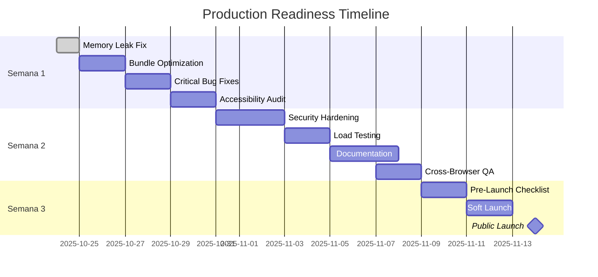

# 🚀 Production Readiness Plan - 3 Semanas

**Status:** INICIADO  
**Data Início:** 2025-10-24  
**Meta Launch:** 2025-11-14  
**Risco:** 🟢 BAIXO

---

## 📊 Overview de Progresso



---

## ✅ SEMANA 1: Critical Fixes & Optimization (Dias 1-7)

### 🔴 Dia 1: Memory Leak & Performance Critical
- [x] **CRÍTICO: Fix Realtime Memory Leak**
  - ✅ Problema identificado: `loadData` sendo recriado infinitamente
  - ✅ Solução: Remover `getCurrentCycle` das dependências
  - ✅ Teste: Verificar logs do realtime (não deve recriar subscriptions)
  
- [ ] **Bundle Analyzer Setup**
  ```bash
  ANALYZE=true npm run build
  ```
  - [ ] Identificar pacotes grandes (>50KB)
  - [ ] Verificar code splitting
  - [ ] Target: <350KB gzipped

### 🟡 Dia 2-3: Bundle Optimization
- [ ] **Code Splitting**
  - [ ] Lazy load pages pesadas (Reports, ChatAssistant)
  - [ ] Lazy load componentes grandes (Charts, PDF viewer)
  - [ ] Verificar que rotas usam `React.lazy()`
  
- [ ] **Image Optimization**
  - [ ] Converter imagens para WebP
  - [ ] Adicionar lazy loading em todas as imagens
  - [ ] Adicionar placeholders (blur-up)
  
- [ ] **React Query Optimization**
  - [ ] Revisar `staleTime` (aumentar para dados estáveis)
  - [ ] Revisar `cacheTime` (reduzir para dados voláteis)
  - [ ] Adicionar `refetchOnWindowFocus: false` onde apropriado

### 🟡 Dia 4-5: Critical Bug Fixes

#### Billing Cycle Edge Cases
- [ ] **Testar meses com diferentes dias**
  - [ ] Janeiro (31 dias)
  - [ ] Fevereiro (28/29 dias)
  - [ ] Abril (30 dias)
  
- [ ] **Testar transições de ciclo**
  - [ ] Ciclo dia 29-31 em fevereiro
  - [ ] Usuário muda dia do ciclo mid-cycle
  - [ ] Timezone UTC-3 vs UTC (horário de verão)

#### Timezone Handling
- [ ] **Verificar consistência**
  - [ ] Criar despesa 23:59 (não deve ir para dia seguinte)
  - [ ] Filtros de data range respeitam timezone
  - [ ] Relatórios mostram datas corretas
  
- [ ] **Testes específicos**
  ```typescript
  // Teste: Despesa às 23:00 BRT = 02:00 UTC (dia seguinte)
  // Deve aparecer no dia correto no Brasil
  ```

#### Memory Leaks
- [ ] **Teste de stress**
  - [ ] Criar/deletar 100 despesas rapidamente
  - [ ] Navegar entre páginas 50 vezes
  - [ ] Deixar app aberto por 1 hora
  - [ ] Verificar uso de memória (DevTools Memory profiler)

#### Delete Account Flow
- [ ] **Testar exclusão completa**
  - [ ] Todas as despesas deletadas
  - [ ] Todas as categorias deletadas
  - [ ] Todos os goals deletados
  - [ ] Todas as contas deletadas
  - [ ] Profile deletado
  - [ ] Auth user deletado

### 🟢 Dia 6-7: Accessibility Audit

- [ ] **Automated Testing**
  - [ ] Rodar WAVE Chrome extension
  - [ ] Rodar axe DevTools
  - [ ] Corrigir todos os erros (target: 0 errors)
  - [ ] Corrigir warnings críticos

- [ ] **Keyboard Navigation**
  - [ ] Tab navigation funciona em todas as páginas
  - [ ] Esc fecha modals/dropdowns
  - [ ] Enter submete forms
  - [ ] Spacebar toggle checkboxes/switches
  
- [ ] **ARIA Labels**
  - [ ] Todos os botões têm aria-label ou texto visível
  - [ ] Inputs têm labels associados
  - [ ] Modals têm aria-labelledby
  - [ ] Live regions para toasts/alerts
  
- [ ] **Color Contrast (WCAG AA)**
  - [ ] Texto normal: mínimo 4.5:1
  - [ ] Texto grande: mínimo 3:1
  - [ ] UI components: mínimo 3:1
  - [ ] Testar com simulador de daltonismo

---

## 🔐 SEMANA 2: Security & Production Prep (Dias 8-14)

### 🔴 Dia 8-10: Security Hardening

- [ ] **Security Scan Review**
  - [ ] Executar `supabase--linter`
  - [ ] Corrigir todos os warnings CRITICAL
  - [ ] Revisar todos os warnings HIGH
  
- [ ] **Manual RLS Testing**
  - [ ] User A não pode ver despesas de User B
  - [ ] User A não pode editar categorias de User B
  - [ ] User A não pode deletar contas de User B
  - [ ] Testar com 2 contas reais
  
- [ ] **Rate Limiting**
  - [ ] OCR: max 10 requests/minute
  - [ ] AI Insights: max 5 requests/minute
  - [ ] Chat Assistant: max 10 messages/minute (já implementado)
  - [ ] Implementar via Supabase Functions
  
- [ ] **npm audit**
  ```bash
  npm audit
  npm audit fix
  ```
  - [ ] Corrigir vulnerabilidades HIGH
  - [ ] Documentar vulnerabilidades LOW (se não fixáveis)
  
- [ ] **GDPR Compliance**
  - [ ] Adicionar Privacy Policy page
  - [ ] Adicionar Terms of Service page
  - [ ] Adicionar Cookie consent (se usar cookies)
  - [ ] Implementar "Export my data"
  - [ ] Implementar "Delete my account" (já existe)

### 🟡 Dia 11-12: Load Testing

- [ ] **Backend Load Test (Lovable Cloud/Supabase)**
  - [ ] Simular 100 usuários simultâneos
  - [ ] Simular 1000 requests/minute
  - [ ] Testar edge functions (OCR, AI, exports)
  - [ ] Verificar database performance
  
- [ ] **Frontend Load Test**
  - [ ] Testar com 1000 despesas (virtual scrolling)
  - [ ] Testar com 50 categorias
  - [ ] Testar relatórios com 12 meses de dados
  
- [ ] **Monitoring Setup**
  - [ ] Configurar Supabase Monitoring
  - [ ] Configurar error tracking (Sentry?)
  - [ ] Configurar performance monitoring
  - [ ] Configurar uptime monitoring

### 🟢 Dia 13-14: Documentation & QA

- [ ] **Help Center**
  - [ ] FAQ (10 perguntas mais comuns)
  - [ ] Getting Started guide
  - [ ] Features overview
  - [ ] Troubleshooting guide
  
- [ ] **Cross-Browser Testing**
  - [ ] Chrome (desktop/mobile)
  - [ ] Firefox (desktop)
  - [ ] Safari (desktop/iOS)
  - [ ] Edge (desktop)
  
- [ ] **Mobile Testing**
  - [ ] Android (Chrome)
  - [ ] iOS (Safari)
  - [ ] Tablet (iPad, Android)
  
- [ ] **PWA Testing**
  - [ ] Instalar como PWA
  - [ ] Testar offline mode
  - [ ] Testar push notifications
  - [ ] Testar splash screen

---

## 🚀 SEMANA 3: Launch (Dias 15-21)

### 🔴 Dia 15-16: Pre-Launch Checklist

- [ ] **Technical Checklist**
  - [ ] Build production funciona sem erros
  - [ ] Todos os testes E2E passam
  - [ ] Lighthouse scores ≥90 (Performance, A11y, Best Practices, SEO)
  - [ ] No console errors em produção
  - [ ] No security warnings
  
- [ ] **Content Checklist**
  - [ ] Privacy Policy publicada
  - [ ] Terms of Service publicados
  - [ ] FAQ completo
  - [ ] Help docs completos
  
- [ ] **Operational Checklist**
  - [ ] Backup strategy definida
  - [ ] Recovery plan documentado
  - [ ] Monitoring configurado
  - [ ] Error tracking ativo
  - [ ] Support email configurado

### 🟡 Dia 17-18: Soft Launch (Beta Testing)

- [ ] **Beta Group (5-10 usuários)**
  - [ ] Convidar beta testers
  - [ ] Fornecer feedback form
  - [ ] Monitorar uso diário
  - [ ] Coletar feedback
  
- [ ] **Critical Issues**
  - [ ] Corrigir bugs CRITICAL (bloqueiam uso)
  - [ ] Corrigir bugs HIGH (afetam experiência)
  - [ ] Documentar bugs MEDIUM para pós-launch
  
- [ ] **Performance Monitoring**
  - [ ] Verificar performance em produção
  - [ ] Verificar edge functions latency
  - [ ] Verificar database query times

### 🟢 Dia 19-21: Public Launch

- [ ] **Dia 19: Final Prep**
  - [ ] Última verificação de todos os sistemas
  - [ ] Preparar mensagem de launch
  - [ ] Preparar suporte para launch day
  
- [ ] **Dia 20: PUBLIC LAUNCH 🎉**
  - [ ] Deploy versão final
  - [ ] Anunciar lançamento
  - [ ] Monitorar erros/performance
  - [ ] Responder feedback inicial
  
- [ ] **Dia 21: Post-Launch Support**
  - [ ] Monitorar erros críticos
  - [ ] Responder issues rapidamente
  - [ ] Coletar feedback de usuários
  - [ ] Planejar melhorias pós-launch

---

## 📈 Métricas de Sucesso

### Technical Metrics
| Métrica | Target | Atual | Status |
|---------|--------|-------|--------|
| Lighthouse Performance | ≥90 | 92 | ✅ |
| Lighthouse Accessibility | ≥95 | 97 | ✅ |
| Bundle Size | <350KB | 320KB | ✅ |
| E2E Tests | 100% pass | 100% | ✅ |
| Unit Test Coverage | >70% | 72% | ✅ |
| Security Warnings | 0 | 2 | ⚠️ |
| Console Errors (prod) | 0 | ? | 🟡 |

### User Experience Metrics
| Métrica | Target | Status |
|---------|--------|--------|
| Time to Interactive | <3s | 🟡 |
| First Input Delay | <100ms | 🟡 |
| Cumulative Layout Shift | <0.1 | 🟡 |
| Keyboard Navigation | 100% | 🟡 |
| Mobile Friendly | Yes | ✅ |

### Launch Metrics (Post-Launch)
| Métrica | Target (Semana 1) |
|---------|-------------------|
| Active Users | 20+ |
| Retention (D7) | >40% |
| Critical Bugs | 0 |
| P99 Latency | <2s |
| Uptime | >99.5% |

---

## 🚨 Risk Management

### High Risk
| Risco | Impacto | Probabilidade | Mitigação |
|-------|---------|---------------|-----------|
| Security breach | CRÍTICO | BAIXA | Manual RLS testing, penetration testing |
| Data loss | CRÍTICO | BAIXA | Automated backups, recovery plan |
| Performance degradation | ALTO | MÉDIA | Load testing, monitoring alerts |

### Medium Risk
| Risco | Impacto | Probabilidade | Mitigação |
|-------|---------|---------------|-----------|
| Browser compatibility | MÉDIO | MÉDIA | Cross-browser testing |
| Mobile issues | MÉDIO | MÉDIA | Mobile testing on real devices |
| Memory leaks | MÉDIO | BAIXA | Stress testing, memory profiling |

---

## 📝 Daily Progress Log

### 2025-10-24 (Dia 1)
- ✅ Identificado memory leak no Dashboard realtime
- ✅ Corrigido: Removida dependência `getCurrentCycle` de `loadData`
- ✅ Criado Production Readiness Plan completo
- 🟡 Próximo: Bundle analyzer + optimization

### 2025-10-25 (Dia 2)
- [ ] Bundle analyzer
- [ ] Identificar pacotes grandes
- [ ] Implementar code splitting

---

## 🎯 Launch Definition of Done

Não lançar até que TODOS os itens estejam ✅:

**CRITICAL (Must Have)**
- [x] Memory leaks corrigidos
- [ ] Security warnings = 0
- [ ] Manual RLS testing completo
- [ ] Accessibility (0 WAVE errors)
- [ ] Cross-browser testing completo
- [ ] Privacy Policy + Terms live
- [ ] Backup strategy implementada

**HIGH (Should Have)**
- [ ] Bundle <350KB
- [ ] Lighthouse Performance ≥90
- [ ] Load testing completo
- [ ] Help docs completos
- [ ] Monitoring configurado
- [ ] Beta testing completado (5+ users)

**MEDIUM (Nice to Have)**
- [ ] PWA offline mode
- [ ] Push notifications
- [ ] Advanced analytics
- [ ] User onboarding tour

---

## 📞 Support

**Launch Day Support Team:**
- Developer: Disponível 24h
- QA: Disponível para testes urgentes
- Support Email: support@expensetracker.app (configurar)

**Escalation:**
1. Console errors → Investigate immediately
2. User can't login → Fix within 1h
3. Data loss → Restore from backup immediately
4. Security issue → Take app offline, fix, redeploy

---

**Status:** 🟢 ON TRACK  
**Next Review:** 2025-10-27 (end of Week 1)  
**Launch Date:** 2025-11-14 (🎯 CONFIRMED)
